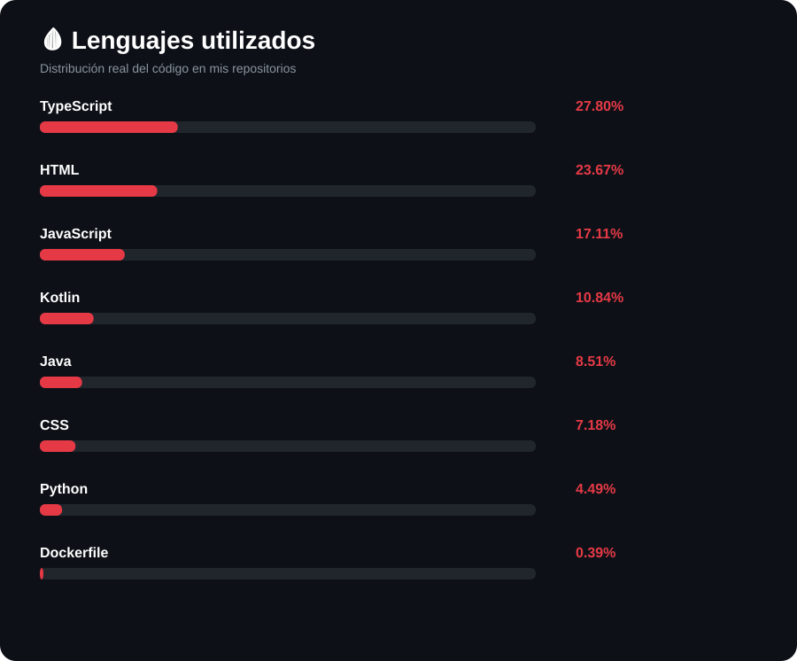
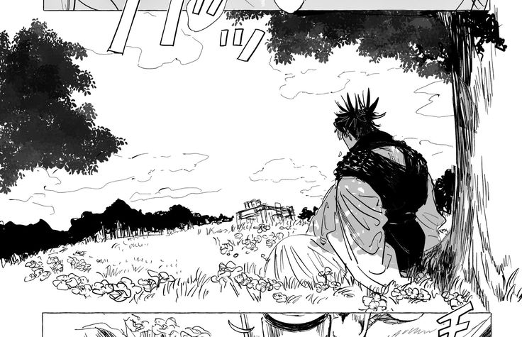

  

#  ALVARO

### `Desarrollador Cloud Native`

**Nube, código y todo lo que hay entre ambos.**

 

☁️ AWS & Cloud Computing   •  
☕ Java   •  
🌱 Spring Boot   •  
🐳 Docker   •  
📱 Kotlin

 

<table>
<tr>

<td width="42%" align="center">

</td>

<td width="58%" valign="top">

##  Sobre mí

Soy un desarrollador interesado en las **tecnologías Cloud Native, el desarrollo backend y la arquitectura de software**.

Me gusta aprender construyendo. Desde APIs y microservicios hasta infraestructura en la nube, me gusta lo que es aprender en la practica y que las cosas resulten

normalmente aprendo solo pero me gusta rodearme de gente que sepa de codigo

 

### 🔻 Actualmente enfocado en

☁️ **AWS & Cloud Computing**
Fortaleciendo mis conocimientos sobre infraestructura y servicios en la nube.

☕ **Java & Spring Boot**
Desarrollando aplicaciones backend y APIs REST.

🚀 **Microservicios & APIs**
Explorando aplicaciones distribuidas y arquitecturas Cloud Native.

🐳 **Docker & CI/CD**
Aprendiendo a contenerizar, automatizar y desplegar aplicaciones.

📱 **Kotlin & Android**
Desarrollando aplicaciones modernas utilizando Kotlin y Jetpack Compose.

🗄️ **MySQL & Backend**
Trabajando con bases de datos y gestión de información en aplicaciones backend.

 

> *"The blood remembers."* 🩸

</td>

</tr>
</table>

 

---

##  Tecnologías

 

 

---

##  Lo que estoy construyendo

### Convirtiendo ideas en código.

<table>
<tr>

<td width="50%" valign="top">

### ☁️ Cloud Native

Explorando el desarrollo **Cloud Native** mediante APIs, microservicios, Spring Boot, Docker y AWS.

Me interesa especialmente comprender cómo las aplicaciones se comunican, escalan y trabajan juntas dentro de entornos distribuidos.

</td>

<td width="50%" valign="top">

### 🚀 Proyectos

Gran parte de mi aprendizaje ocurre **construyendo**.

Trabajo en proyectos académicos y personales donde puedo experimentar con nuevas tecnologías, resolver problemas y convertir conceptos en aplicaciones funcionales.

</td>

</tr>
</table>

 

---

## 🩸 Estadísticas de GitHub

 

  

  

  

  

  

  

---

  

###  Seguir intentandolo es seguir evolucionando

`CODE`   `CLOUD`   `CREATE`

  

